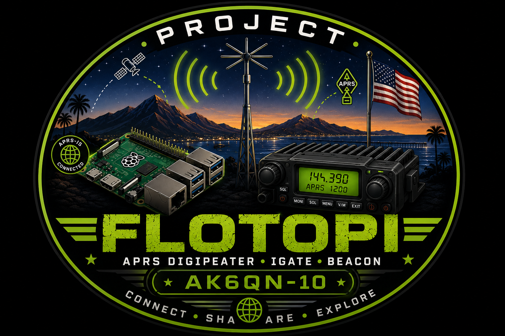
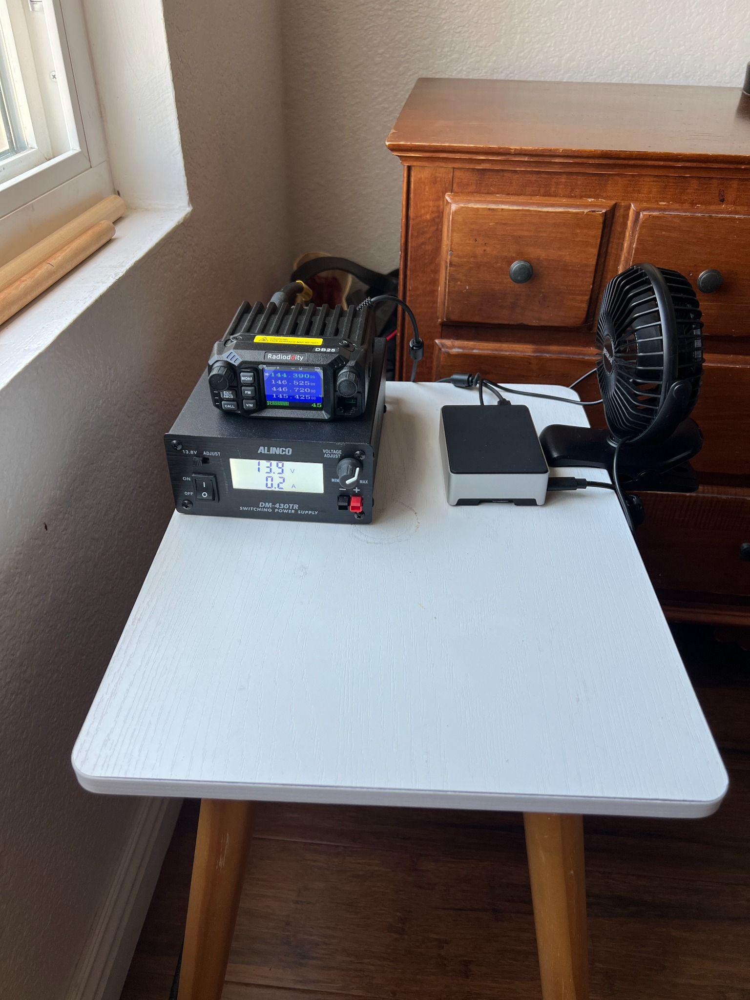
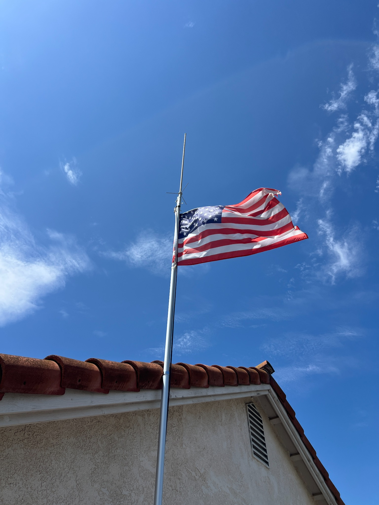

# 🚀 Project FLOTOPI

> **A Raspberry Pi APRS infrastructure station built one lesson at a time.**

---

## AK6QN-10

Welcome to **Project FLOTOPI**.

Project FLOTOPI is a Raspberry Pi–based APRS infrastructure station located in Oceanside, California.

The goal of the project is simple:

> Build a professional-quality APRS station while documenting every step so other amateur radio operators can learn from the process.

---

## Current Status

✅ Production APRS iGate

✅ WIDE1-1 Fill-In Digipeater

✅ Raspberry Pi Dashboard

✅ Automatic Startup (`systemd`)

✅ Passwordless SSH

✅ Comet GP-3 Base Antenna

## Project Station

### Control Station

### Antenna System

---

## Hardware

- Raspberry Pi 4
- Radioddity QB25
- Digirig Lite
- Comet GP-3
- Alinco DM-430TR Power Supply
- LMR-400 Feedline

---

## Software

- Raspberry Pi OS
- Direwolf
- Flask Dashboard
- Python
- Git
- GitHub

---

## Roadmap

### Version 1.0
Production APRS infrastructure station

### Version 1.1
GP-3 antenna evaluation

### Version 1.2
Project FLOTOPI Dashboard

### Version 2.0
Winlink

### Version 3.0
Project FLOTOPI Lab

---

## Why?

This project exists for two reasons:

1. To build a reliable APRS infrastructure station.

2. To help other amateur radio operators learn how to build one.

---

73,

**Chuck Floto**
**AK6QN**

Oceanside, California
